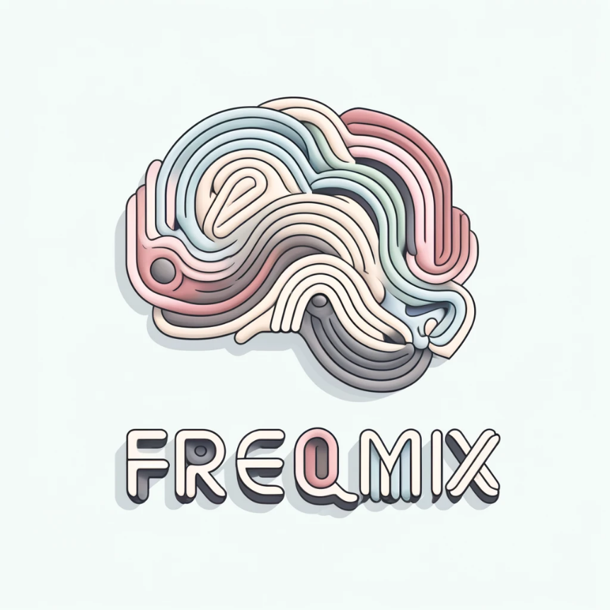

# *freqmix*: Frequency mixing decomposer

This is the official repository of *freqmix*, a toolbox for decomposing frequency mixing within time-series signals. Originally purposed for neuroscientific data, e.g., EEG, LPF data) but is general to any time-series signal data. It examines harmonics, triplets and quadruplets.

<p align="center">
  
</p>

Rhythmic neural oscillations underpin cognitive and motoric processes and regulate numerous activity-dependent cellular processes in the brain. In the presence of non-linearities, concurrent oscillatory signals can combine to generate novel oscillations, a process described as frequency mixing. It has not yet been determined whether frequency mixing occurs at the single neuron, nor the origin of frequency mixing in neural activity. Moreover, the presence of frequency mixing in human brain activity and whether it plays a functional role is still an open question.
Here, we introduce a mathematical framework to robustly identify frequency mixing interactions in noisy data using higher-order dependence tests on the instantaneous phase of frequency components.

<div align="center">


[📚Documentation]() |
[💡DEMOS]() |
[🛠️ Installation]() |
[🌎 Home Page]() |
[🚨 News]() |
[🪲 Reporting Issues](https://github.com/ImperialCollegeLondon/freqmix)


[](https://twitter.com/RobertPeach15)

https://img.shields.io/badge/license-MIT-blue

</div>

# Welcome! 👋


**freqmix** is a library for identifying frequency mixing interactions in neural data.  

To receive updates on code releases, please 👀 watch or ⭐️ star this repository!


# Installation


Follow these steps to install ``freqmix`` on your system.

### Prerequisites

Before you begin, ensure you have met the following requirements:
- [MATLAB](https://www.mathworks.com/)
- [Git](https://git-scm.com/downloads)


### Cloning the Repository

To install ``freqmix``, clone the repository to your local machine:

```bash
git clone https://github.com/ImperialCollegeLondon/freqmix.git
```

# Demos

Explore the `./examples/` directory to find a variety of examples demonstrating the capabilities and usage of ``freqmix``. These examples are designed to help you get started and to showcase the features of the project.

## Getting Started

To run an example, navigate to the `examples` directory and execute the desired script. 

# Reference

- 📄 **Preprint January 2023**:
  [The neuron mixer and its impact on human brain dynamics.](https://doi.org/10.1101/2023.01.05.522833)
  Luff, C.E., Peach, R., ... , and Grossman, N.
  
- 📄 **Full Publication April 2024**:
  [The neuron mixer and its impact on human brain dynamics.](), 
  Luff, C.E., Peach, R., ... , and Grossman, N. Cell Reports.
  
# License

This project is licensed under the MIT License - see the [LICENSE](LICENSE) file for details.


